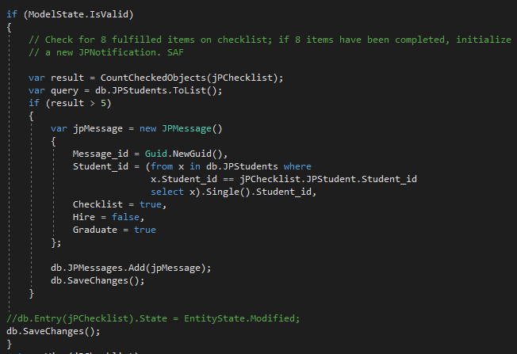

# Job Placement Dashboard Retrospective
## Introduction
For my two-week live project, I worked on a C# MVC program using the Code-First Entity Framework for the Job Placement department. This project gave me invaluable experience working as a team, both in-person and remotely, and researching unfamiliar skills. I also had the opportunity to take on new challenges as a junior developer and how to be both flexible and curious when approaching the debugging process.

Below are screenshots and descriptions of the stories that I worked on during our sprint.

## Front-End Stories
### Style Changes to Navbar
This task required making changes to the Site.css so that the background color of the Job Placement Dashboard navbar matched the navbar in the Student LMS.

### Style Changes to JPBulletins/Index View
This front-end story uses Bootstrap 3 to create a card-like grid in the JPBulletins Index view. 

## Back-End Stories
### Add Display Names to JPApplication Model Properties
My task was to add display names to the JPApplicaton model properties so that the data organization would be neat and easier to read in the view.

### Create Controllers for JPMeetupGroups and JPOutsideContacts with Scaffolded Views
This story asked me to create new controllers for JPMeetUps and JPOutsideContacts with scaffolded views.

### Edit DeleteConfirmed Method on the JPStudentController: Deletion of JPStudent Also Deletes Associated JPChecklist

### Edit HTTP:POST Method in JPChecklistController: Create Notification When More Than 5 Checklist Items Have Been Completed
This story was multi-part: it was first necessary to create the JPNotificationsController with scaffolded views around the existing JPNotifications model. From there, I wrote code to count the amount of items marked off in a checklist after it has been edited; if more than 5 items have been marked as completed, a new JPNotification entry would have been created and appear in the JPNotifications view for the Job Placement administrator. 

While debugging with my project managers and another developer, we realized that the table was created incorrectly during the project initialization and it required us to shift gears, create a new table, and the code was re-written for JPMessages.

### Limit JPApplications/Create View to Authenticated Users Only
My task was to limit the JPApplications/Create view authenticated users only. If users are not logged in, they are sent to an error page that can be customized at a later date by students in the next sprint.

### Remove About and Contact Views and Functions from Views/Home Folder and Controller
I removed unnecessary About and Contact views and functions from the home folder and controller.

## Additional Skills I Learned
* How to work on a team of developers using Azure DevOps, Slack, and Visual Studio.
* How to debug with a remote team member.
